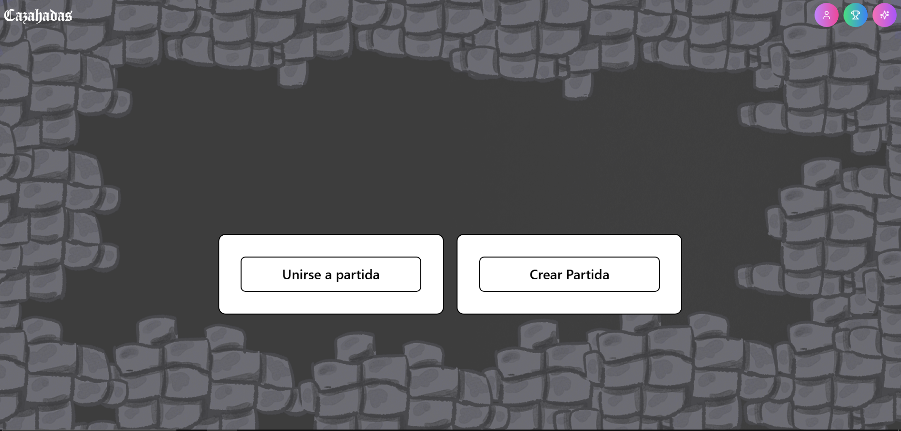
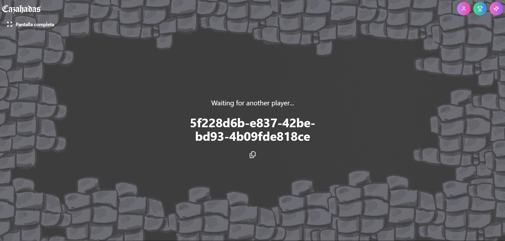
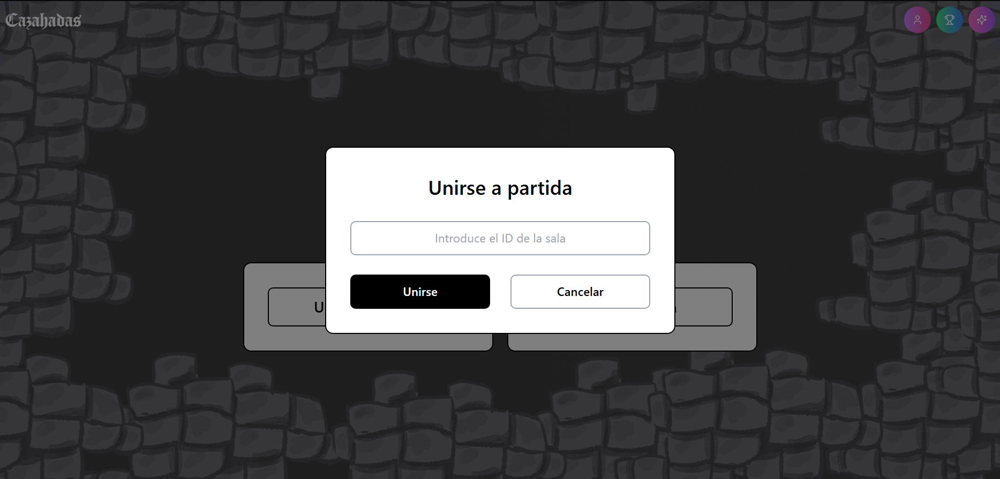
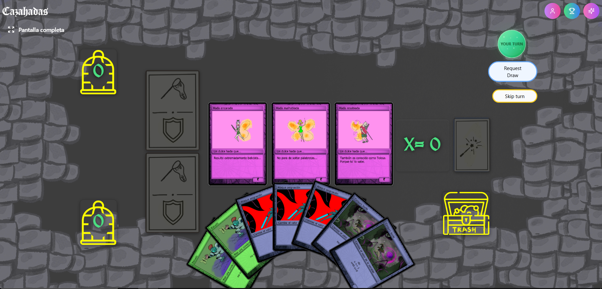
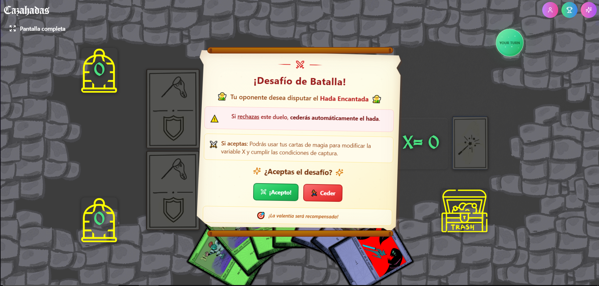
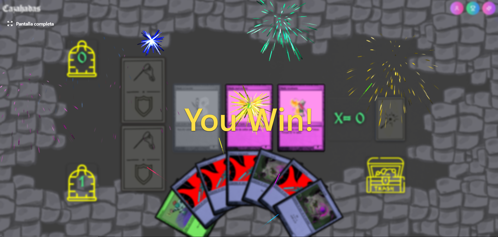
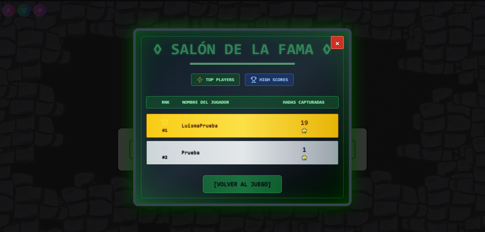

<h1 align='Center'>
  🧚 Cazahadas 🧚
</h1>

Cazahadas es una aplicación web multijugador que digitaliza el juego de cartas educativo del mismo nombre, creado por Enol Junquera Álvarez como herramienta didáctica para la enseñanza de conceptos básicos de programación. Dos jugadores se enfrentan en tiempo real con el objetivo de capturar más hadas que el rival mediante el uso estratégico de cartas mágicas y defensivas.

> **Nota:** La aplicación está optimizada para navegadores modernos en resolución 1920x1080. En dispositivos móviles se recomienda el modo horizontal.

## 🖥️ Tecnologías utilizadas

**Frontend**
- React 18 y TypeScript
- Tailwind CSS para los estilos
- Zustand para la gestión del estado global
- Vite como bundler

**Backend**
- Node.js con Socket.io para la comunicación en tiempo real

**Proxy**
- FastAPI (Python) para la gestión segura de la base de datos

**Base de datos**
- MongoDB Atlas

**Despliegue**
- Render (tier gratuito)

## 🌐 Versión desplegada

La aplicación está disponible en:

👉 `https://cazahadas.onrender.com`

> Al estar en el tier gratuito de Render, el servicio puede tardar hasta 30 segundos en responder tras un periodo de inactividad.

## 🔧 Cómo ejecutar el proyecto en local

Clona el repositorio (requiere acceso, ver sección de contribución):

```sh
git clone https://github.com/Luisma9530/cazahadas.git
cd cazahadas
npm install
```

Arranca el frontend y el servidor Node.js simultáneamente:

```sh
npm run dev-client
```

En una terminal separada, instala las dependencias Python y arranca el proxy FastAPI:

```sh
pip install -r requirements.txt
uvicorn main:app --reload
```

Crea un fichero `.env` en la raíz del proyecto con las variables de entorno necesarias. Consulta la sección de despliegue de la memoria para ver la lista completa de variables requeridas.

La aplicación estará disponible en `localhost:5173`.

## 🧩 Cómo jugar

### Pantalla de inicio

Desde la pantalla de inicio puedes crear una nueva partida o unirte a una existente mediante un código de sala.



### Crear una partida

Pulsa el botón "Crear Partida". Se generará un código UUID único que deberás compartir con el otro jugador.



### Unirse a una partida

Pulsa el botón "Unirse a partida", introduce el código de sala que te ha proporcionado el otro jugador y pulsa "Unirse".



▶️ [Ver vídeo: Cómo unirse a una partida](https://www.youtube.com/watch?v=hJsq4UkHWCU)

### Tablero de juego

Una vez iniciada la partida, el tablero muestra las tres hadas disponibles en el centro, la variable X, las zonas de defensa y magia de ambos jugadores, y la mano de cartas en la parte inferior.



▶️ [Ver vídeo: Ejemplo de partida completa](https://www.youtube.com/watch?v=4J0RtAslSVc)

### Mecánica de batalla

Cuando un jugador intenta capturar un hada, el defensor recibe una notificación para decidir si acepta la batalla o cede el hada directamente.



### Fin de partida

La partida finaliza cuando un jugador captura dos de las tres hadas, por acuerdo de tablas, o por abandono de uno de los jugadores.



### Ranking

Cualquier usuario puede consultar el ranking general ordenado por número de hadas capturadas. Para acumular puntuación es necesario registrarse.



## 📜 Reglas básicas

Cada jugador dispone de una baraja de 28 cartas de tres tipos:

- **Cartas de captura:** inician un intento de captura sobre un hada disponible.
- **Cartas mágicas:** modifican el valor de la variable X mediante operaciones matemáticas y bucles de programación.
- **Cartas defensivas:** establecen una condición lógica que protege el hada si se cumple al finalizar la batalla.

El objetivo es capturar dos de las tres hadas disponibles. Durante cada batalla, ambos jugadores pueden usar cartas mágicas para modificar la variable X. El defensor puede colocar una carta defensiva cuya condición se evaluará al finalizar el combate. La batalla termina cuando ambos jugadores saltan turno consecutivamente.

## 🔨 Cómo modificar el juego

### Añadir o modificar cartas

El mazo completo está definido en `src/utils/Deck.tsx`. Cada carta mágica incluye una función `operation(x: number): number` y cada carta defensiva una función `defenseCondition(x: number): boolean`. Al añadir una carta nueva en `Deck.tsx`, `HydrateCard.tsx` la recoge automáticamente sin necesidad de modificación adicional.

### Modificar reglas de batalla

La lógica de resolución de batalla reside en `server/index.ts`, en el manejador del evento `skip-turn`.

## 🚀 Despliegue propio en Render

Para desplegar una instancia propia son necesarios dos servicios en Render:

**Servidor Node.js**
- Runtime: Node
- Build command: `npm run build`
- Start command: `npm run start`

**Proxy FastAPI**
- Runtime: Python
- Build command: `pip install -r requirements.txt`
- Start command: `uvicorn main:app --host 0.0.0.0 --port $PORT`

Despliega primero el proxy FastAPI y usa su URL como valor de `VITE_API_URL` en el servicio Node.js antes de realizar el build, ya que Vite incrusta esa URL en el bundle de producción durante la compilación.
